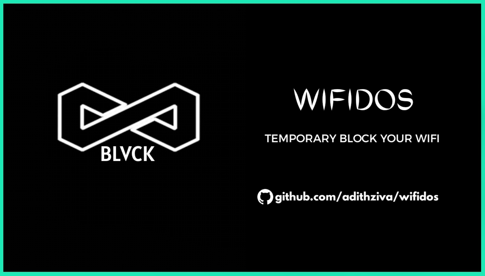
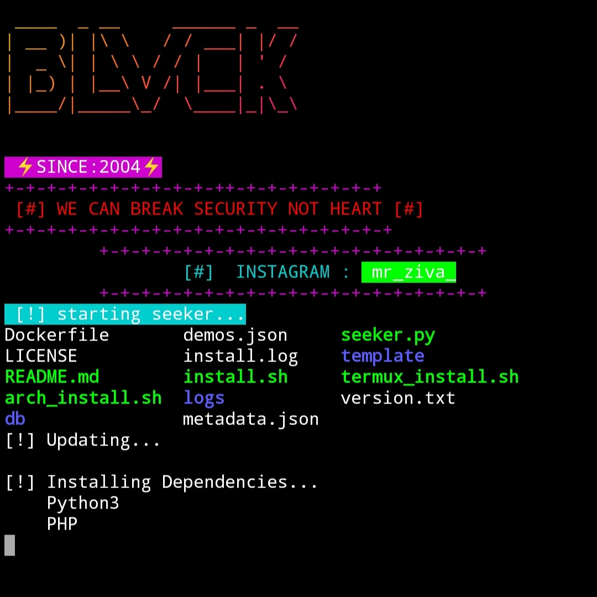
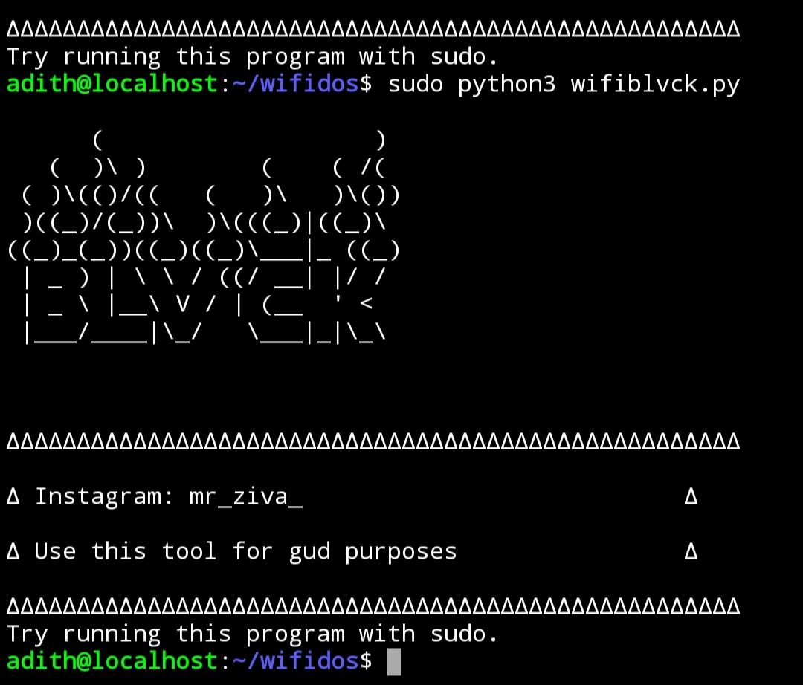

<h1 align="center">WifiDos</h1>
This is an simple tool for Kali used to dos a wifi
for temporary. don't Misuse this tool

<p align="center">
<a href="https://github.com/adithziva"></a>
</p>
<p align="center">
<a href="https://github.com/adithziva"></a>
<a href="https://github.com/adithziva"></a>
<a href="https://github.com/adithziva"></a>
</p>
<p align="center">
<a href="http://github.com/adithziva"></a>
</p>
<p align="center">
<a href="https://github.com/adithziva"></a>
<a href="#"></a>
<a href="#"></a>
</p>
<p align="center">
<a href="https://github.com/adithziva"></a>
<a href="https://instagram.com/mr_ziva_"></a>
<a href="https://github.com/adithziva"></a>
<a href="https://github.com/adithziva"></a>
<a href="https://github.com/adithziva"></a>
<a href="https://github.com/adithziva"></a>
</p>


### CLONE
```
★ pkg update && pkg upgrade
★ pkg install python
★ git clone https://github.com/adithziva/wifidos.git
★ ls
★ cd wifidos
★ ls
★ python3 wifiblvck.py
```
</br>


### SCREENSHOT
<p align="center">
<a href="http://github.com/adithziva"></a>
<a href="http://github.com/adithziva"></a>
</P>

<h4 align="center">OWNER</h4>
<p align="center">For more information contact on</p>


<p align="center">
<a href="https://blvcksec.ml"></a>
<a href="https://instagram.com/mr_ziva_"></a>
</p>

<h3 align="center">SOCIAL MEDIA</h3>

### Connect with me:

[][website]
[][twitter]
[][linkedin]
[][instagram]
[][whatsapp]

<br/>

[website]: http://blvcksec.ml
[twitter]: https://twitter.com/adithziva?s=09
[instagram]: https://instagram.com/mr_ziva_
[linkedin]: #
[whatsapp]: #


## WARNING : 

***This tool is only for educational purpose. If you use misuse this tool for other purposes. we will not be responsible for that cases.***


